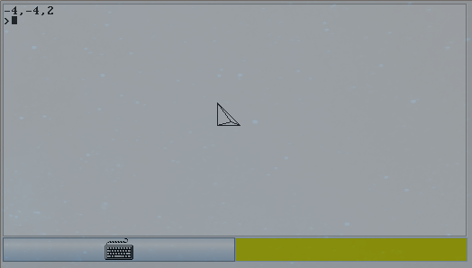

# AutoChAD
AutoChAD è un applicativo CAD (*computer aided drafting*, "disegno tecnico
assistito dall'elaboratore"). È in grado di lavorare con solidi tridimensionali
tramite prospettiva con singolo punto di fuga.

## Guida all'uso
* Se la matita si trova in una qualche posizione sul foglio, le sue coordinate
tridimensionali vengono mostrate in alto a sinistra.

* `>` funge da *prompt*. Se è allineato all'estremo sinistro, richiede un singolo
carattere che specifica il [comando](#Comandi) desiderato; se è tabulato,
richiede un parametro aggiuntivo per l'ultimo comando inserito. Nel caso di
numeri interi, premere `Invio` dopo l'inserimento di ciascun parametro.

## Comandi
Codice | Nome | Descrizione | Parametri
------ | ---- | ----------- | ---------
C | `Clear screen` | Pulisce il foglio. |
S | `Swap colors` | Passa dal tema chiaro allo scuro e viceversa. |
P | `Pixel` | Disegna un punto sul foglio. | Tre interi rappresentanti le coordinate del punto.
L | `Line` | Traccia un segmento sul foglio: il primo estremo è l'attuale posizione della matita. | Tre interi rappresentanti le coordinate del secondo estremo.
U | `Undo` | Annulla l'ultima azione della matita (punto o linea). |

A questi comandi si aggiungono:
* le quattro frecce direzionali
* `+`
* `-`

Non accettano parametri e vengono usati per spostare l'osservatore.

## Avvertenze
* Se un elemento è anche solo parzialmente fuori dal campo di visibilità
dell'osservatore, non verrà mostrato a schermo.

* La posizione iniziale dell'osservatore è (0, 0, 0), quindi i punti conù
coordinata z non positiva non sono immediatamente visibili.

## Esempio
Il seguente codice genera un piccolo tetraedro non regolare:
```
>P
 >-4
 >1
 >2
>L
 >1
 >1
 >2
>L
 >-4
 >1
 >7
>L
 >-4
 >1
 >2
>L
 >-4
 >-4
 >2
>L
 >1
 >1
 >2
>P
 >-4
 >1
 >7
>L
 >-4
 >-4
 >2
```


Si consiglia al lettore di prendere dimestichezza con i comandi di disegno e
movimento partendo da questa figura.